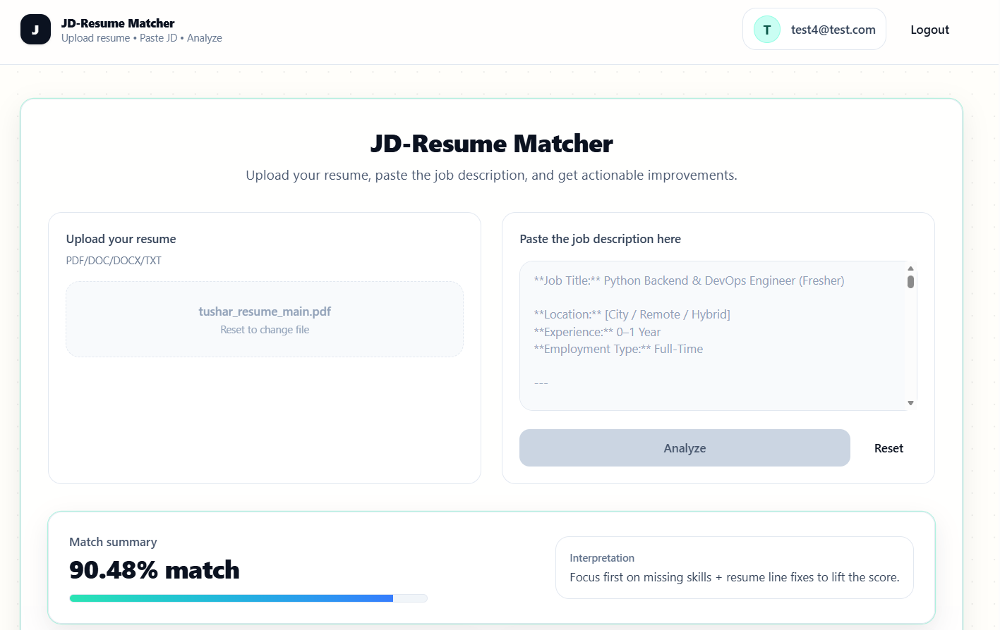
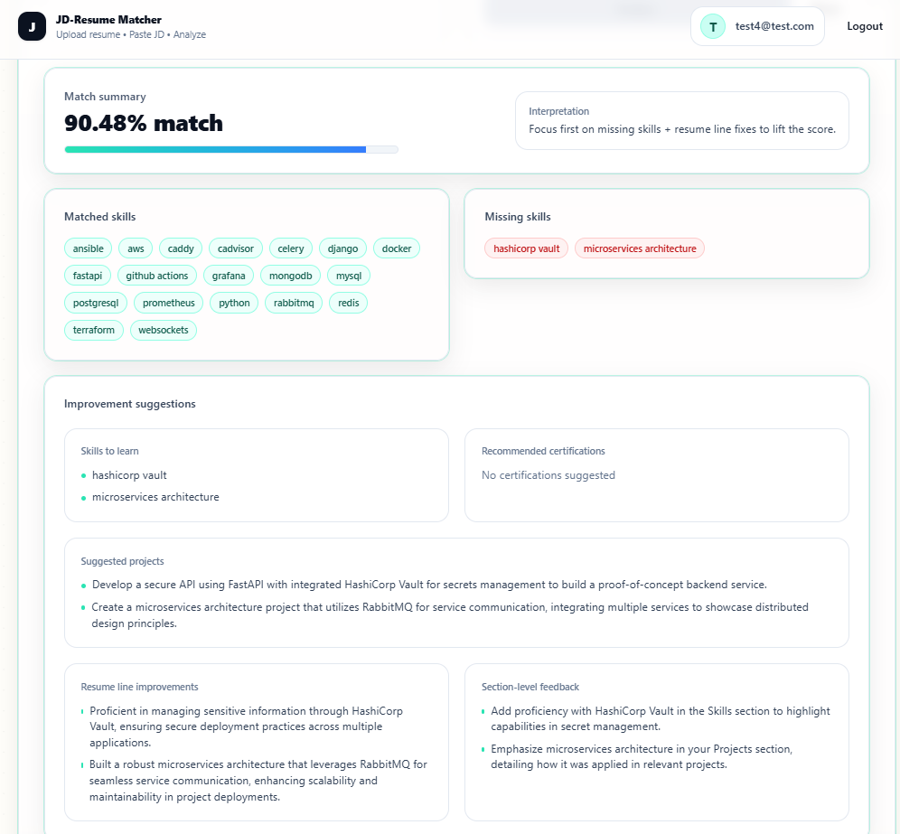

# JD-Aware Resume Optimization Engine

A backend-focused AI system that analyzes a candidate’s resume against a specific Job Description (JD) and returns structured, role-aligned improvement suggestions using a **schema-constrained multi-agent LLM workflow** plus a **deterministic skill-matching layer**.

---

## Table of Contents

- [Overview](#overview)
- [Output Images](#output-images)
- [Key Features](#key-features)
- [System Architecture](#system-architecture)
  - [Agents](#agents)
  - [Deterministic Skill Matching](#deterministic-skill-matching)
  - [Orchestration Flow](#orchestration-flow)
- [Tech Stack](#tech-stack)
- [API Endpoints](#api-endpoints)
- [Request/Response Formats](#requestresponse-formats)
  - [Login Response](#login-response)
  - [Signup Response](#signup-response)
  - [Analyze Response](#analyze-response)

---

## Overview

The **JD-Aware Resume Optimization Engine** is a **structured multi-agent LLM workflow** orchestrated by a deterministic pipeline.

It is designed to:

- Parse resumes and JDs into strict schemas
- Compute explicit skill overlap and gaps deterministically
- Generate **gap-driven** improvement suggestions with guardrails (no recomputation / no hallucinated skills)
- Return structured JSON suitable for UI rendering

This is **not** a fully autonomous agent system. It is a **multi-stage workflow** with:

- **Symbolic evaluation** (rule-based matching)
- **Probabilistic reasoning** (LLM-based suggestions)  
  kept intentionally separate for control and explainability.

---

## Output Images

---

## Key Features

- **Resume Parsing Agent**
  - Converts extracted resume text into a structured JSON schema
  - Extracts skills, projects, experience summary, certifications, education
  - Uses strict Pydantic schema validation

- **JD Parsing Agent**
  - Extracts actionable backend requirements and high-signal keywords
  - Removes marketing/boilerplate language
  - Outputs domain focus, keywords, expected experience, etc.

- **Deterministic Skill Matching**
  - ATS-style overlap scoring (keyword-based)
  - Produces:
    - match percentage
    - matched skills
    - missing skills
  - Ensures transparent, explainable results

- **Suggestion Agent**
  - Receives: parsed resume schema + parsed JD schema + precomputed gaps
  - Generates targeted improvements **only based on identified gaps**
  - Guardrails prevent the agent from:
    - recomputing match results
    - inventing new skills not in the gap list

- **FastAPI + JWT Authentication**
  - Signup/Login protected routes
  - `/api/analyze` requires `Authorization: Bearer <token>`

- **Frontend**
  - React + TailwindCSS + animations
  - Protected routes (only login/signup public)
  - Clean UI and structured result rendering

---

## System Architecture

### Agents

1. **Resume Parsing Agent**
   - Input: raw resume text (extracted from PDF/DOC/TXT)
   - Output: strict resume schema (validated)

2. **JD Parsing Agent**
   - Input: raw JD text
   - Output: strict JD schema (validated)

3. **Suggestion Agent**
   - Input: resume schema + JD schema + deterministic match results
   - Output: strictly structured suggestions (validated)

Each stage validates output against predefined schemas before passing data forward.

---

### Deterministic Skill Matching

Between parsing and suggestions, the system runs a rule-based matching layer:

- Computes keyword overlap between resume skills and JD requirements
- Identifies missing skills
- Calculates match percentage
- Mimics ATS keyword filtering behavior

This ensures the suggestion layer cannot override the computed skill gap logic.

---

### Orchestration Flow

1. Extract text from resume (PDF/DOC/TXT)
2. Resume Parsing Agent → validated resume JSON
3. JD Parsing Agent → validated JD JSON
4. Deterministic Skill Matching → computed overlap + gaps + % score
5. Suggestion Agent → targeted improvements based on gaps
6. Return structured response to client

---

## Tech Stack

**Backend**

- Python
- FastAPI
- OpenAI LLM APIs
- OpenAI Agents SDK
- Pydantic (schema validation + structured outputs)
- Async orchestration
- JWT Authentication

**Frontend**

- React (JavaScript + JSX)
- React Router DOM (protected routes)
- TailwindCSS (latest)
- Framer Motion (animations)

---

## API Endpoints

| Method | Route              | Auth | Description              |
| -----: | ------------------ | :--: | ------------------------ |
|   POST | `/api/auth/signup` |  No  | Create user + return JWT |
|   POST | `/api/auth/login`  |  No  | Login + return JWT       |
|   POST | `/api/analyze`     | Yes  | Analyze resume vs JD     |

**Authorization**

- `/api/analyze` requires:  
  `Authorization: Bearer <JWT_TOKEN>`
